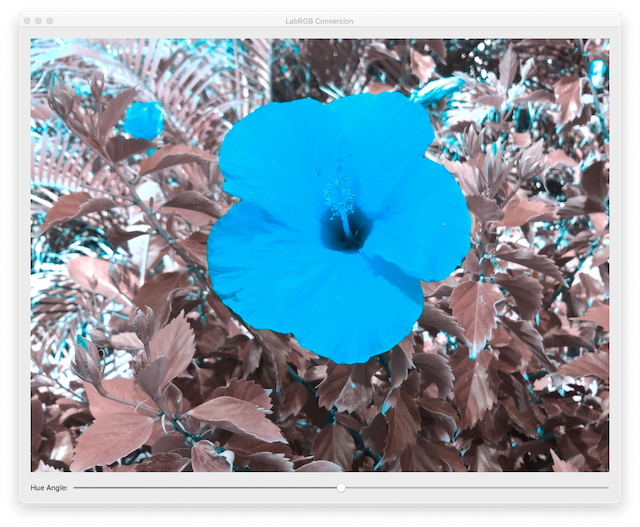
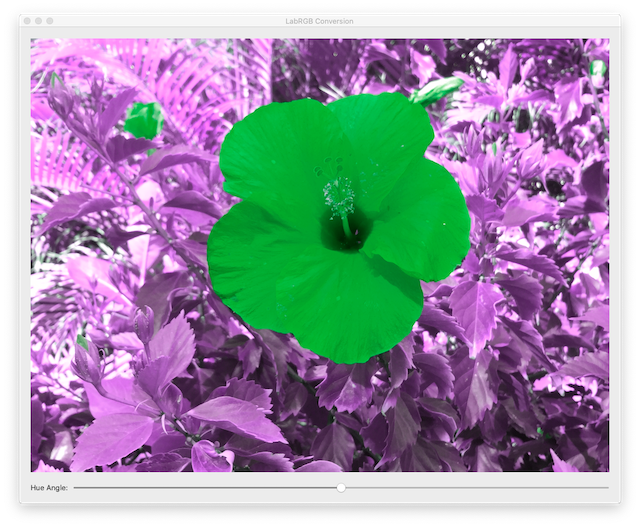

## Convert an RGB image to L*a*b* color space and apply hue adjustment
 
 

Based on Apple's `Adjusting the hue of an image` distributed with XCode 11.6
 
 

**Observation:**
 

The colours of the rendered image are not correct for -90, 90, 180 degrees; only a rotation of 0 degree is correct. 
 

 
 

Applying the call `vImagePermuteChannels_ARGB8888` to change the ordering of the colour channels does not help.
 
 

## Development Plaftorm
 
 

XCode 11.6, Swift 5.0
 
 

Deployment target is set at macOS 10.15.x

 
 

**WebLinks**

Latest version:

https://developer.apple.com/documentation/accelerate/adjusting_the_hue_of_an_image
